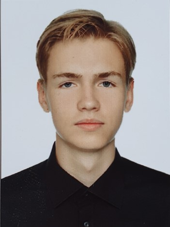

# rsschool CV

# Nikita Ivanov
### Telegram: [@gerpot](https://t.me/gerpot)
### Discord: [Hukuta02](https://discordapp.com/users/382939522083848202)

## About
__Bornplace: Vitebsk, Belarus__
__Age: 19__

I am _PSU student_ now. Studying geodesy and want to try something new. Want to find job that will be complicatable with university studies. And in future I want to have some kind of chose **where and what** I want to be. Like stay in my origin country or leave it. As soon as i want to be independent i chosen to study programming. I'm interested in it and ready to spend my free time on it.

## Skills

English level: B1
Computer literacy

## Education

Graduated: Gymnasium #2, Vitebsk
Studying: Polotsk State University, Novopolotsk

## Language

English, Russian, minor Belarussian;